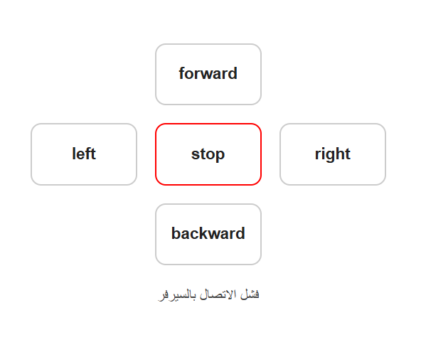
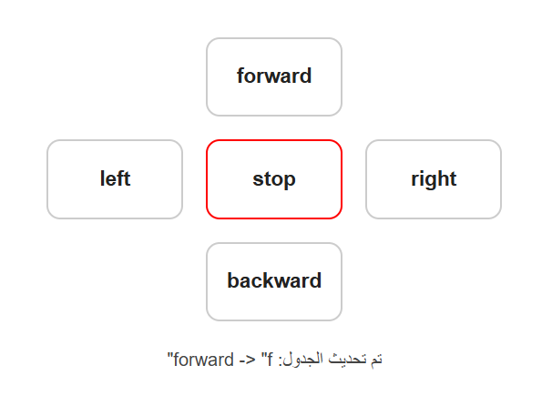
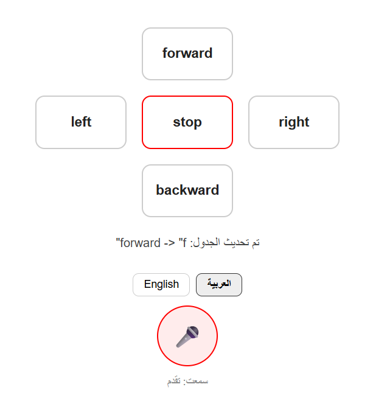
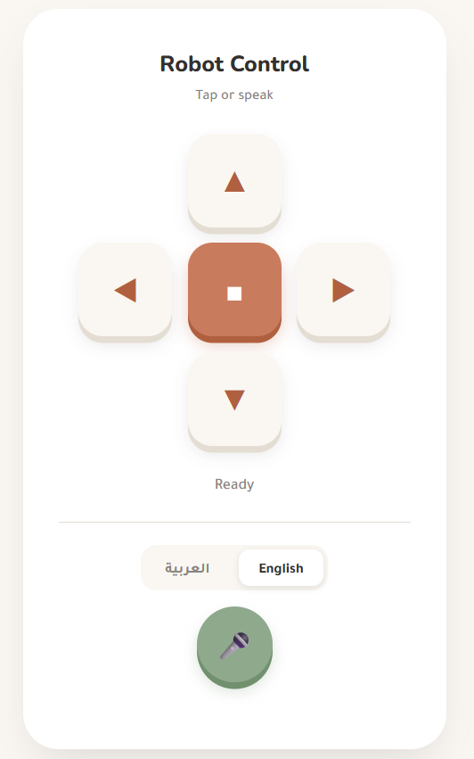
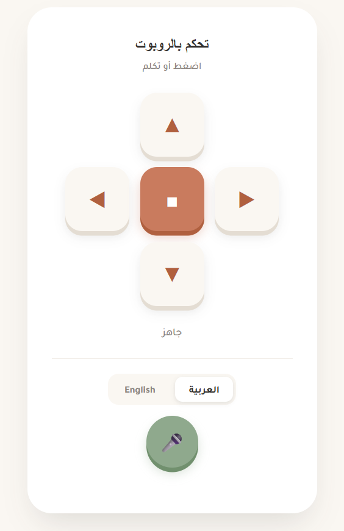

# Robot-Control-Panel-Tap-Voice-commands

## Overview

This project focuses on developing a web-based control panel for a robot. The system allows the user to control the robot through manual buttons and voice commands. The interface was also designed to support both Arabic and English.

The project was developed through several stages, starting with fixing the original control panel, then adding voice control, and finally improving the interface and organizing the code.

---

## Live Website

[**Open the Robot Control Panel**](https://nassebah.infinityfreeapp.com/ControlPanel/)

## Robot State

The current robot command can be viewed through the `get_state.php` endpoint:

[**View Robot State**](https://nassebah.infinityfreeapp.com/ControlPanel/get_state.php)

---

## 1. Control Panel Setup

The project started with a basic robot control panel containing buttons for movement.

The provided files were uploaded to InfinityFree. Initially, pressing a button resulted in a **"Failed to connect to server"** error.

The problem was caused by the database not being set up. I used `setup.sql` in phpMyAdmin to create the `robot_state` table and configured the database credentials in `db.php`.

After this, the control buttons successfully updated the robot's command in the database.

---

## 2. Adding Voice Control

After getting the manual controls working, I added a microphone function to allow the robot to be controlled using voice commands.

The browser's **Web Speech API** was used to convert speech into text. The recognized text is then matched with predefined Arabic and English movement commands and sent using the same command system as the control buttons.

The voice control was designed to support both Arabic and English commands.

---

## 3. Improving the User Interface

The original interface was then redesigned using a **Soft Tactile Remote** style.

The design was updated with:

* Rounded control buttons
* Warm clay and sage colors
* Improved typography
* Pressed-in button animations
* A more organized control layout
* A dedicated microphone button

---

## 4. Bilingual Interface

The interface was made fully bilingual, allowing the user to switch between **Arabic and English**.

The language toggle changes the visible interface text, status messages, and page direction between **RTL** and **LTR**.

Voice recognition also follows the selected interface language:

* **Arabic mode:** accepts Arabic voice commands.
* **English mode:** accepts English voice commands.

### English Interface

### Arabic Interface

---

## Final Result

The final system provides:

* A web-based robot control panel
* Manual movement controls
* Voice-to-text control
* Arabic and English voice commands & UI
